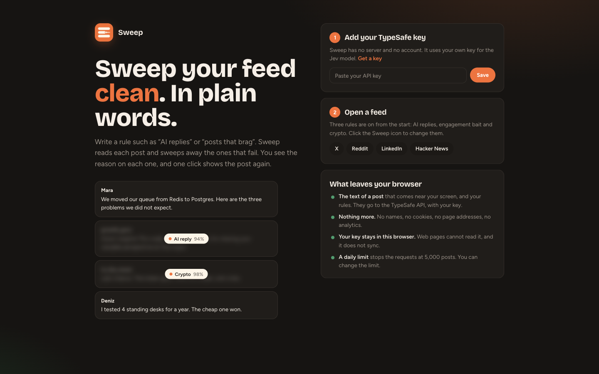
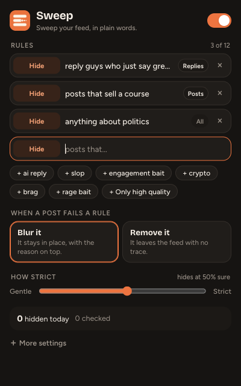

<p align="center"></p>
<h1 align="center">Sweep</h1>
<p align="center"><b>Sweep your feed clean. In plain words.</b></p>

Write a rule such as `AI replies` or `posts that brag`. Sweep reads each post in your feed and blurs the ones that fail a rule. Each blurred post shows the reason, and one click shows the post again.

It works on **X**, **Reddit**, **LinkedIn** and **Hacker News**.

<p align="center"></p>

## What you can do

| You write | Sweep does |
|---|---|
| `Hide` AI reply | Blurs replies that read as AI-generated |
| `Hide` posts that sell a course | Blurs them, with the score on top |
| `Show only` high quality | Blurs each post that is **not** high quality |

- **Two rule types:** `Hide` and `Show only`. You can mix them.
- **A scope for each rule:** all, replies only, or posts only. Jev reads your new rule and chooses the scope, and you can change it with one click. (Sweep sees replies on X post pages. On the other sites, each item is a post.)
- **Two results:** blur the post (it keeps its place and its size, with the reason) or remove it.
- **No jumps:** the blur fades in. In remove mode, a post below the screen goes at once, and a post that you see closes softly.
- **One slider:** from gentle to strict.
- **Ready rules:** AI reply, slop, engagement bait, crypto, brag, rage bait, only high quality.

<p align="center"></p>

## Install

1. Download this repository (`Code` → `Download ZIP`) and unzip it.
2. Open `chrome://extensions` and turn on **Developer mode**.
3. Click **Load unpacked** and select the folder.
4. The welcome page opens. Paste your TypeSafe API key and click **Save**.
5. Open a feed.

You need a key for the [TypeSafe](https://docs.typesafe.ai/introduction/quickstart) API. Sweep has no server of its own: you bring your own key.

## How it works

Sweep uses [Jev](https://docs.typesafe.ai), a small model from TypeSafe that does not write text. It answers a yes/no question with a probability, in about one second.

1. A post comes near your screen.
2. The extension asks Jev one question for each rule: *"Does the post match this description?"*
3. A `Hide` rule fails the post when the answer is "yes" with more certainty than your slider. A `Show only` rule fails it when the answer is "no".
4. The post gets a blur and a label, for example `AI reply 94%`.

All rules for one post go in one request. A post is checked one time for each set of rules. When a check fails, Sweep tries that post one more time, and then it stops.

## Privacy and security

**What leaves your browser**

- The text of a post that comes near your screen, the text of the original post when the post is a reply, the name of the site, and your rules.
- They go to `api.typesafe.ai` only, with your key.
- Nothing more: no author names, no cookies, no page addresses, no analytics. There is no Sweep server.

**How the key and the rules are kept**

- The key, the rules and all settings are in `chrome.storage.local`. The extension sets that area to `TRUSTED_CONTEXTS`, so content scripts, and the web pages they run in, cannot read or change the store. The worker sends the feed script a copy of the rules and the display settings only: no key, no limit, no counter.
- Nothing syncs to other devices. Only the service worker sends the key, and only to `api.typesafe.ai`.
- The extension checks a new key with one test request before it saves it.
- The feed page gives the worker the post text only. The worker adds the rules from its own store, so a page cannot send its own questions with your key.
- The labels on a blurred post sit in a closed shadow root. The scripts of the feed page can see that a post is blurred, but they cannot read your rule text.

**Other guards**

- The only permission is `storage`. The only host permission is `https://api.typesafe.ai/*`.
- The service worker accepts messages from this extension only, and filter requests from the five feed sites only.
- Each request has limits: 12 rules, 300 characters for a rule, 1,500 characters for a post.
- A daily limit (5,000 posts, you can change it) counts each post before its request goes out. When the server is busy, one request makes up to 4 attempts. One post uses 2 requests at most for one set of rules, and each request takes its own place under the limit.
- The worker reads the on/off switch before each request. When you turn Sweep off, the waiting requests and the retries stop. The queue holds 80 requests at most.
- No remote code, no `eval`, no `innerHTML` with page content. The fonts are in the package.

**Limits you must know**

- Jev makes errors. Use the blur mode first, and turn on "Show the scores" to tune a rule.
- A post can contain text that tries to trick the model. The worst result is a wrong blur.
- The feed sites change their pages. When a site changes, a selector in `content.js` can stop working. Open an issue.

## Cost

The popup shows an estimate for today. With three rules, one post uses about 500 input tokens (measured). One thousand posts cost about $0.02 at $0.042 for one million tokens. Check the TypeSafe price page for the current price.

## Add a site

A site is one entry in `ADAPTERS` in `content.js`:

```js
{
    site: 'Reddit',
    host_re: /reddit\.com$/,
    selector: 'shreddit-post',                       // the post elements
    text: el => el.getAttribute('post-title') ?? '', // the text to check
}
```

Add the site to `matches` in `manifest.json` and to `FEED_HOSTS` in `background.js`.

## Credits

- Judgments: [TypeSafe Jev](https://docs.typesafe.ai)
- Fonts: [Bricolage Grotesque](https://fonts.google.com/specimen/Bricolage+Grotesque) and [Figtree](https://fonts.google.com/specimen/Figtree), SIL Open Font License (see `fonts/`)
- Licence: MIT

Sweep is an independent project. It is not connected to X, Reddit, LinkedIn, Y Combinator or TypeSafe.
